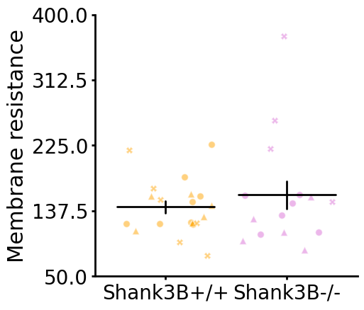
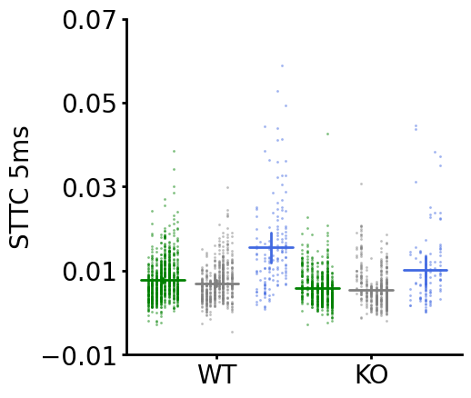
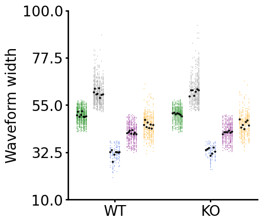
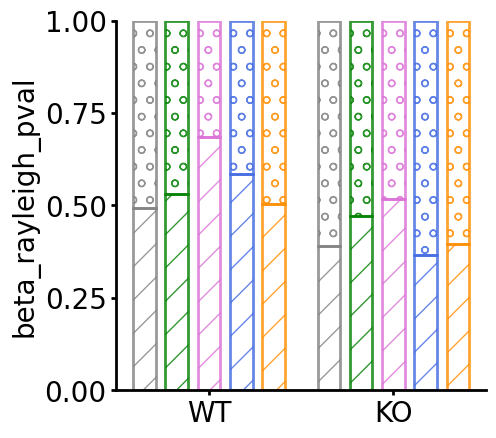
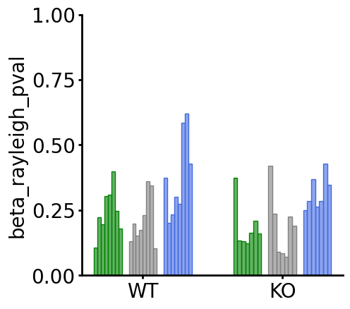
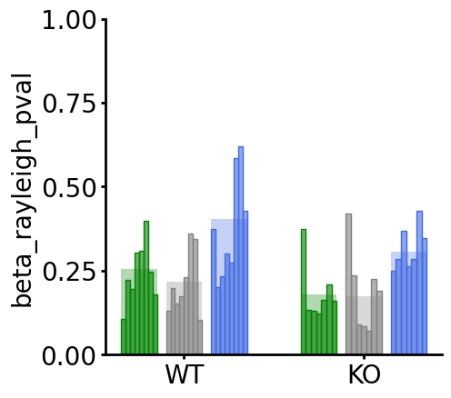
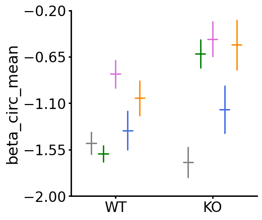
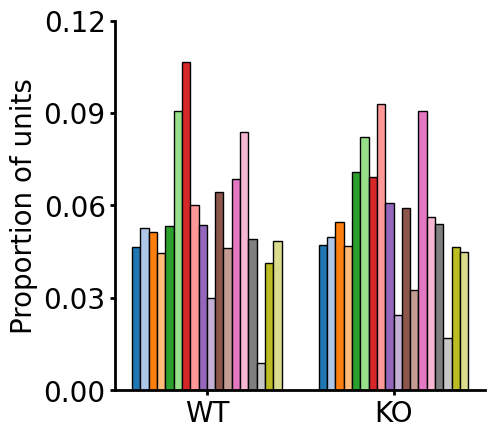
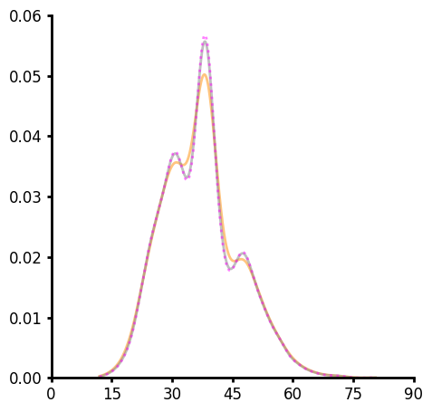
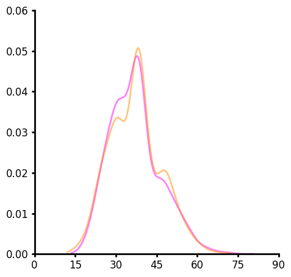

This is a simple plotting and stats package written in Python and intend for scientific publications (i.e. plotting data that would be used in t-test or one/two-way ANOVAs). There is a strong focus on plotting clustered data within groups. This is particularly useful for studies where many neurons are measured per mouse. Some of the plots can utilize Matplotlib or Plotly backend. Data can be transformed (log10, inverse, etc) or aggregated (mean, median, circular mean, etc). Space between groups is easy to specify using width or jitter. It is currently in development so there may be bugs. See below for install some simple examples.

Install from github (need to have git installed)
```bash
pip install git+https://github.com/LarsHenrikNelson/StatsAndPlots.git
```

Install locally
1. Download the package
2. Open a shell or terminal
3. Activate your python environment
4. Type ```cd ```
5. Then drag and drop the folder into the terminal and hit enter
6. Then type ```pip install .``` and hit enter

## Example plots
Some example plots with the code used below the plot.

### Jitter with unique id (i.e. animal, data, etc) setting marker type and summary (mean) overlayed.


```python
path = r"path/to/save/data"
fig = (
    CategoricalPlot(
        df=df_lhn.dropna(subset=columns[column]),
        y="Membrane resistance,
        y_label="Membrane resistance",
        group="genotype",
        group_order=[r"Shank3B+/+", r"Shank3B-/-"],
        group_spacing=1.25,
        title="",
        inplace=False,
    )
    .jitter(
        unique_id="date",
        color={r"Shank3B+/+": "orange", r"Shank3B-/-": "orchid"},
        edgecolor="white",
        alpha=0.5,
        jitter=0.8,
        transform=None,
        marker_size=7,
    )
    .summary(
        func="mean",
        capsize=0,
        capstyle="round",
        bar_width=0.8,
        err_func="sem",
        linewidth=2,
        transform=None,
        color="black",
    )
    .plot_settings(
        style="default",
        # y_lim=[0, 8],
        y_scale="linear",
        steps=5,
        margins=0.1,
        aspect=1,
        figsize=None,
        labelsize=22,
        linewidth=2,
        ticksize=2,
        ticklabel=20,
        decimals=2,
    )
    .plot(savefig=True, path=path, filetype="png", backend="matplotlib")
)
```

### Jitteru with unique id (i.e. animal, data, etc). Each unique id is given a column within the group column. With summary overlayed.


```python

path = r"path/to/save/data"
column = "sttc_5ms"
temp = (
    CategoricalPlot(
        df=df,
        y=column,
        y_label="STTC 5ms",
        group="genotype",
        group_order=[r"WT", r"KO"],
        subgroup="cell_type_short",
        subgroup_order=["PS", "PL", "I"],
        group_spacing=1.0,
        subgroup_spacing=1.4,
        title="",
        inplace=False,
    ).jitteru(
        unique_id="id",
        edgecolor="none",
        width=0.55,
        alpha=0.5,
        color={
            "PS": "green",
            "PL": "grey",
            "I": "royalblue",
            "IB": "purple",
            "IS": "orange",
        },
    )
    .summary(
        func="mean",
        capsize=0,
        capstyle="round",
        bar_width=0.8,
        err_func="ci",
        linewidth=2,
        alpha=0.8,
        color={
            "PS": "green",
            "PL": "grey",
            "I": "royalblue",
        },
    )
)
temp.plot(savefig=True, path=path, filetype="png", backend="matplotlib")
```

### Jitteru using an aggregate func


```python
path = r"path/to/save/folder"
temp = (
    CategoricalPlot(
        df=df,
        y=column,
        y_label="Waveform width",
        group="genotype",
        group_order=[r"WT", r"KO"],
        subgroup="cell_type_short",
        # subgroup_order=["PS", "PL", "I"],
        subgroup_order=["PS", "PL", "I", "IB", "IS"],
        group_spacing=1.0,
        subgroup_spacing=1.4,
        title="",
        inplace=False,
    )
    .jitteru(
        unique_id="id",
        edgecolor="none",
        marker=".",
        width=0.55,
        marker_size=2,
        alpha=0.8,
        color={
            "PS": "green",
            "PL": "grey",
            "I": "royalblue",
            "IB": "purple",
            "IS": "orange",
        },
    )
    .jitteru(
        unique_id="id",
        edgecolor="black",
        jitter=0.0,
        width=0.55,
        alpha=0.9,
        color="black",
        agg_func="mean",
        marker_size=2,
        marker="o"
    )
)
temp.plot(savefig=True, path=path, filetype="png", backend="matplotlib")
```

### Percent plot where the y-axis represents fraction of samples below and above a cutoff (i.e. p-value cutoff).


```python

path = r"path/to/save/folder"
column = "beta_rayleigh_pval"
temp = (
    CategoricalPlot(
        df=df,
        y=column,
        y_label=column,
        group="genotype",
        group_order=[r"WT", r"KO"],
        subgroup="cell_type_short",
        subgroup_order=["PS", "PL", "I", "J", "K"],
        group_spacing=1.0,
        subgroup_spacing=1.0,
        title="",
        inplace=False,
    )
    .percent(
        cutoff=0.05,
        include_bins=[True, True],
        fill=False,
        hatch=True,
        linecolor={
            "PS": "green",
            "PL": "grey",
            "I": "royalblue",
            "J": "orchid",
            "K": "darkorange"
        },
        alpha=0.3,
        bar_width=0.8,
        linewidth=0,
    )
    .plot(savefig=True, path=path, filetype="png", backend="matplotlib")
)
```

### Percent plot with unique id where the y-axis represents fraction of samples below and above a cutoff (i.e. p-value cutoff).


```python

path = r"path/to/save/folder"
column = "beta_rayleigh_pval"
temp = (
    CategoricalPlot(
        df=df,
        y=column,
        y_label=column,
        group="genotype",
        group_order=[r"WT", r"KO"],
        subgroup="cell_type_short",
        subgroup_order=["PS", "PL", "I"],
        group_spacing=1.0,
        subgroup_spacing=1.0,
        title="",
        inplace=False,
    )
    .percent(
        cutoff=0.05,
        include_bins=[True, False],
        fill=True,
        hatch=None,
        unique_id="id",
        linecolor={
            "PS": "green",
            "PL": "grey",
            "I": "royalblue",
        },
        facecolor={
            "PS": "green",
            "PL": "grey",
            "I": "royalblue",
        },
        alpha=0.6,
        bar_width=0.8,
        linewidth=1,
    )
    .plot(savefig=True, path=path, filetype="png", backend="matplotlib")
)
```

### Percent plot with unique on top of percent plot.


```python

path = r"path/to/save/folder"
column = "beta_rayleigh_pval"
temp = (
    CategoricalPlot(
        df=df,
        y=column,
        y_label=column,
        group="genotype",
        group_order=[r"WT", r"KO"],
        subgroup="cell_type_short",
        subgroup_order=["PS", "PL", "I"],
        group_spacing=1.0,
        subgroup_spacing=1.0,
        title="",
        inplace=False,
    )
    .percent(
        cutoff=0.05,
        include_bins=[True, False],
        fill=True,
        hatch=None,
        linecolor={
            "PS": "green",
            "PL": "grey",
            "I": "royalblue",
        },
        facecolor={
            "PS": "green",
            "PL": "grey",
            "I": "royalblue",
        },
        alpha=0.3,
        bar_width=0.8,
        linewidth=0,
    )
    .percent(
        cutoff=0.05,
        include_bins=[True, False],
        fill=True,
        hatch=None,
        unique_id="id",
        linecolor={
            "PS": "green",
            "PL": "grey",
            "I": "royalblue",
        },
        facecolor={
            "PS": "green",
            "PL": "grey",
            "I": "royalblue",
        },
        alpha=0.6,
        bar_width=0.8,
        linewidth=1,
    )
    .plot(savefig=True, path=path, filetype="png", backend="matplotlib")
)
```

### Summary plot (mean of group).


<br/>

### Count plot (similar to a histogram of non-numeric data, splitting categorically similar to other categorical plots)


```python
column = "group"
temp = (
    CategoricalPlot(
        df=df_output,
        y=column,
        y_label="Proportion of units",
        group="genotype",
        group_order=["WT", "KO"],
        group_spacing=1.0,
        title="",
        inplace=False,
    ).count(
        bar_width=0.8, facecolor=color_mapping, axis_type="density", linecolor="black"
    )
    .plot()
)
```
### KDE plot with ISJ, scott or silverman bandwidth type, split by categories


```python
LinePlot(df=df_acc, y="me_time").kde(bw="ISJ", line_color="darkorange", alpha=0.5).kde(
    bw="silverman", alpha=0.5, line_color="grey"
).kde(bw="scott", alpha=0.5, line_color="magenta", linestyle="dotted").plot()
```



```python
LinePlot(df=df_acc, y="me_time", group="genotype").kde(
    bw="ISJ", line_color={"WT": "darkorange", "KO": "magenta"}, alpha=0.5, common_norm=False
).plot()
```